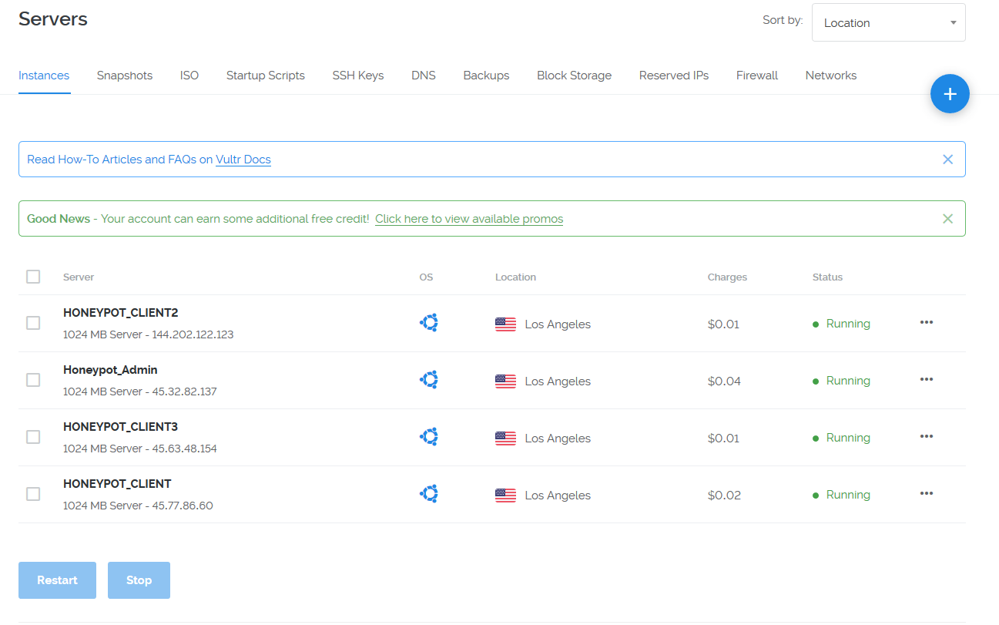

# Week-9-Honeypot

Greetings Ladies and Sirs!
This week we created a honeypot to lure in unsuspecting hackers. Already we've got a multinational crew throwing a barrage of attacks.
To start, I used my new favorite cloud provider. <bold><color='red'>vultr.com!</color></bold> I like it because it is lightweight and simple to use. I enjoy that it is also quite cheap. 

I created 4 servers. One as a honeypot admin and the others as clients. All are Ubuntu 14.04 Ol' Trusty

I ran into a problem with the admin installation because I'm proud and don't listen to Rain's directions before I try something new. There was a problem with https://github.com/RedolentSun/mhn.git, and she had linked us to a different git. It took me a while trying to troubleshoot before I realized that she had mentioned this. Rain is so smart.

After I installed Modern Honey Network, I applied this firewall to HONEYPOT_ADMIN

I then started up a second Ubuntu 14.04 server and it was almost very simple to install the MHN client upon it using the deploy page on HONEYPOT_ADMIN. However, I lacked the package 'software-properties-common'. It took me 10 minutes to figure this out though. You can see where I failed. 

After this failure, it was much easier to install the honey trap on the other 2 Ubuntu servers, which went swimmingly.

Now, I'm recieving attacks constantly. It's scary and cool. I see why organizations need information security professionals. I've put together a few images to show how much I'm going attacked.

This the the .json export.

<a href="session.json">.json file</a>
